# Gmail to Google Sheets Automation

A Python 3 automation system that securely reads unread Gmail messages using OAuth 2.0 and logs filtered email data into Google Sheets with duplicate prevention and production-grade logging.

## **Author:** Harshita Singh


##  High-Level Architecture

```mermaid
graph TD
    A[Gmail Inbox<br/>Unread Emails] -->|OAuth 2.0 Desktop Flow| B[Gmail API]
    K[Load State<br/>state.json] --> B
    B --> C[Email Parser]
    C --> D{Subject Filter<br/>Contains 'Invoice'?}
    D -->|No| E[Skip Email<br/>Log Action]
    D -->|Yes| F[HTML → Plain Text<br/>Conversion]
    F --> G[Truncate Content<br/>Max 49k chars]
    G --> H[Google Sheets API]
    H --> I[Append Row to Sheet]
    I --> J[Mark Email as Read]
    J --> K2[Update State File<br/>state.json]
    K2 --> L[Log Completion]

    %% High-contrast styles
    style A fill:#E3F2FD,color:#000000,stroke:#1565C0,stroke-width:2px
    style B fill:#E8F5E9,color:#000000,stroke:#2E7D32,stroke-width:2px
    style C fill:#F3E5F5,color:#000000,stroke:#6A1B9A,stroke-width:2px
    style D fill:#FFFDE7,color:#000000,stroke:#F9A825,stroke-width:2px
    style E fill:#FBE9E7,color:#000000,stroke:#D84315,stroke-width:2px
    style F fill:#E0F2F1,color:#000000,stroke:#00695C,stroke-width:2px
    style G fill:#E1F5FE,color:#000000,stroke:#0277BD,stroke-width:2px
    style H fill:#E8F5E9,color:#000000,stroke:#1B5E20,stroke-width:2px
    style I fill:#C8E6C9,color:#000000,stroke:#1B5E20,stroke-width:2px
    style J fill:#FFF3E0,color:#000000,stroke:#EF6C00,stroke-width:2px
    style K fill:#FFF9C4,color:#000000,stroke:#F57F17,stroke-width:2px
    style K2 fill:#FFF9C4,color:#000000,stroke:#F57F17,stroke-width:2px
    style L fill:#ECEFF1,color:#000000,stroke:#37474F,stroke-width:2px

```



---

##  Setup Instructions

### Prerequisites
- Python 3.7+
- Google Cloud Project with Gmail API and Google Sheets API enabled
- OAuth 2.0 Desktop Application credentials

### Installation

1. **Clone the repository**
   ```bash
   git clone <repository-url>
   cd Gmail2Sheet-Assignment
   ```

2. **Create and activate virtual environment**
   ```bash
   python -m venv venv
   # Windows PowerShell
   venv\Scripts\Activate.ps1
   # Linux/Mac
   source venv/bin/activate
   ```

3. **Install dependencies**
   ```bash
   pip install -r requirements.txt
   ```

4. **Configure OAuth credentials**
   - Create a Google Cloud project
   - Enable Gmail API and Google Sheets API
   - Configure OAuth 2.0 (Desktop Application)
   - Download credentials and place at `credentials/credentials.json`

5. **Update configuration**
   - Edit `config.py` and add your Google Sheet ID
   - Ensure your Google Sheet has headers: `From | Subject | Date | Content`

6. **Run the script**
   ```bash
   python src/main.py
   ```

---

##  OAuth Flow

**OAuth 2.0 Desktop Flow** is used for authentication:

1. User authenticates via browser on first run
2. Access and refresh tokens stored locally in `token.json`
3. Tokens are reused across runs to avoid repeated login
4. Tokens regenerated only when switching Gmail accounts

**Why this approach?**
- Works with personal Gmail accounts (service accounts not allowed for Gmail API)
- Secure and industry-standard
- User-friendly with token persistence

**Scopes Used:**
- `https://www.googleapis.com/auth/gmail.modify` - Read and modify Gmail
- `https://www.googleapis.com/auth/spreadsheets` - Read and write Sheets

---

##  Duplicate Prevention Logic

The system prevents duplicates through a multi-layered approach:

1. **Unread Email Filter**: Only processes unread emails from Inbox
2. **Timestamp-based State**: Stores last processed email timestamp in `state.json`
3. **Mark as Read**: After successful processing, emails are marked as READ
4. **Incremental Processing**: On re-run, only emails newer than stored timestamp are considered

**Flow:**
- First run: Processes all unread emails, saves newest timestamp
- Subsequent runs: Only processes emails newer than saved timestamp
- Result: Idempotent execution with zero duplicates

---

##  State Persistence Method

State is stored in a local JSON file (`state.json`):

```json
{
  "last_timestamp": 1737183456789
}
```

**Why this approach?**
- ✅ Lightweight (no database required)
- ✅ Easy to debug and verify
- ✅ Reliable across script re-runs
- ✅ File excluded from version control (`.gitignore`)

The timestamp represents the internal date of the last processed email (Unix epoch in milliseconds), ensuring chronological ordering and preventing reprocessing.

---

##  Challenges Faced & Solutions

### 1. OAuth Scope Issues
**Problem:** Initial OAuth token allowed Gmail access but failed when writing to Google Sheets (403 insufficient scopes).

**Solution:** Combined Gmail and Sheets scopes into a single OAuth flow and regenerated the token, ensuring one access token had permission for both APIs.

### 2. Python Import Errors
**Problem:** Assignment required `config.py` outside `src/`, causing module import errors.

**Solution:** Dynamically added project root to Python's path using `sys.path.append()` to maintain required structure without refactoring.

### 3. Google Sheets Cell Size Limitation
**Problem:** Some emails exceeded Google Sheets' 50,000-character cell limit.

**Solution:** Truncated email bodies to 30,000 characters before insertion and converted HTML to plain text for better readability.

### 4. HTML Emails as Raw Markup
**Problem:** Many emails were logged as raw HTML, reducing readability.

**Solution:** Implemented HTML → plain text conversion using BeautifulSoup before appending content to Sheets.

---

##  Limitations

- Only processes emails from **Inbox** (not Promotions/Spam folders)
- Subject filter keyword (`invoice`) is currently **hardcoded**
- Email content is **truncated** to 30k characters to comply with Google Sheets limits
- Designed for **single-user** Gmail account (multi-account support not implemented)
- Requires manual OAuth consent on first run

---

##  Features Implemented

### Mandatory Features ✅
- Gmail API integration with OAuth 2.0
- Google Sheets API integration
- Email parsing (From, Subject, Date, Content)
- Duplicate prevention via state persistence
- Secure credential handling (no secrets committed)

### Bonus Features ⭐
- ✅ Subject-based filtering (processes only emails containing "Invoice")
- ✅ HTML → plain text conversion using BeautifulSoup
- ✅ Logging with timestamps (written to `app.log`)

---

##  Proof of Execution

All required screenshots are available in the `/proof` directory:

1. `1_gmail_unread_emails.png` - Gmail inbox showing unread emails
2. `2_oauth_consent_screen.png` - OAuth consent screen
3. `3_oauth_authentication_completed.png` - Authentication completion
4. `4_terminal_logging_and_success.png` - Terminal logs showing successful execution
5. `5_google_sheet_invoice_filtered_row.png` - Google Sheet populated with filtered data

---

##  Project Structure

```
gmail-to-sheets/
│
├── src/
│   ├── gmail_service.py      # Gmail API operations
│   ├── sheets_service.py      # Google Sheets API operations
│   ├── email_parser.py        # Email parsing & HTML conversion
│   └── main.py                # Main execution script
│
├── credentials/
│   └── credentials.json       # OAuth credentials (NOT COMMITTED)
│
├── proof/                     # Screenshots directory
│
├── config.py                  # Configuration settings
├── requirements.txt           # Python dependencies
├── .gitignore                 # Git ignore rules
└── README.md                  # This file
```

**Note:** `token.json`, `state.json`, and `app.log` are generated at runtime and excluded from version control.

---

## Security

- ✅ `credentials.json` excluded from version control
- ✅ `token.json` excluded from version control
- ✅ `state.json` excluded from version control
- ✅ No API keys or secrets committed
- ✅ `.gitignore` properly configured

---

## 🤝 Contributing

This is an assignment submission. Contributions are not expected, but feedback is welcome.
Made with ❤️ by Harshita Singh.

